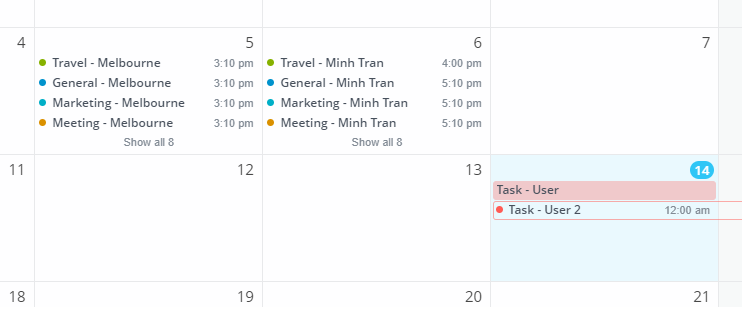
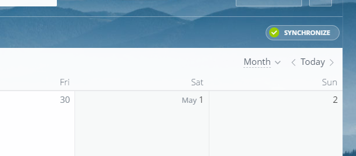
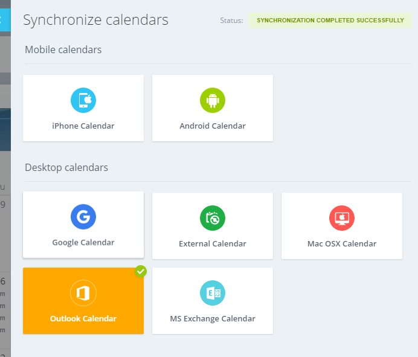
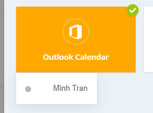
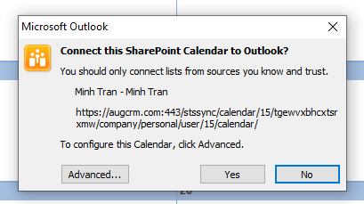
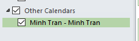
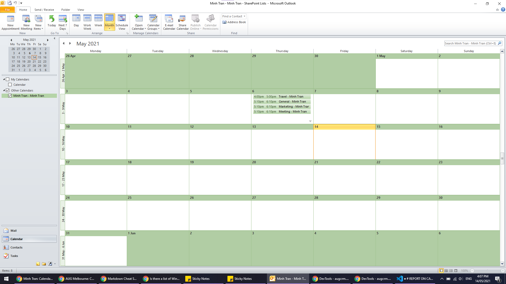
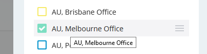
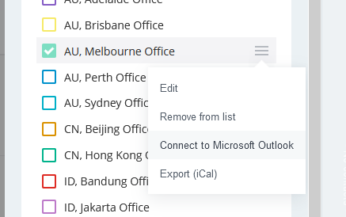
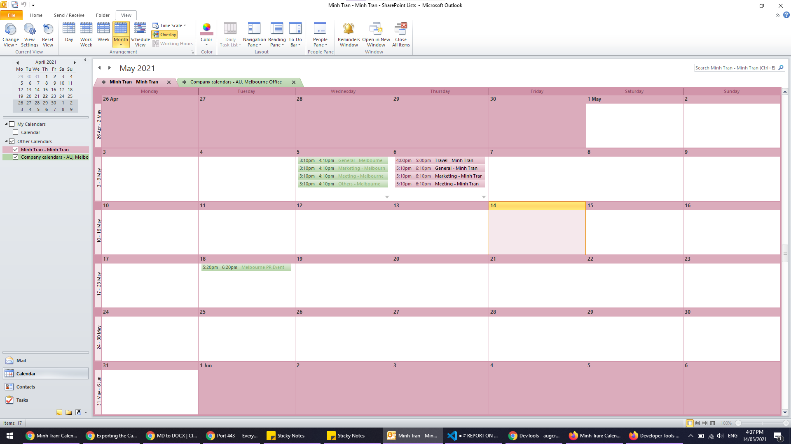

# REPORT ON CALENDAR SYNCHRONIZATION

---

## Introduction

- Bitrix has available feature to synchronize its calendar with other calendar systems (e.g. Outlook, Android, iOS, Google, etc.);
- This report will be focusing on calendar synchronization between Bitrix Calendar and Outlook Calendar.

### Bitrix to Outlook

- The goal of this experiment is to see the events in Bitrix to be synchronized to Outlook Calendar.

#### Setup

 There a few events in Bitrix Calendar that will be tested to see synchronization to Outlook Calendar.

- There are different types of entries showed on Bitrix Calendar:

    1. User events / entries
    2. Company and workgroup events / entries
    3. User task

- The test will determine what entries will be transferred to Outlook Calendar.

---

There are company calendar events (from Melbourne Calendar), User events (from Minh Tran Calendar) and user tasks.

---

#### Procedure

- Step 1: Select the Synchronize Button on top right corner of Bitrix Calendar page.

- Step 2: Select Outlook Calendar in Desktop calendars section.

- Step 3: Select Current User Calendar (in this case it's Minh Tran)

- Step 4: In Outlook, accept synchronization prompt.

- Once done, Outlook will show newly synchronized calendar in Calendar section

---

#### Result

- The result shows that there are only the events from User Calendar transferred from Bitrix Calendar (or in this case exported).

- Tasks and Company Calendar events are not exported.

---

#### Conclusion

- Using this procedure, this can only export, and connect the User Calendar to Outlook. However, there is another for connecting Bitrix Company Calendar to Outlook Calendar.

---

### Bitrix Company Calendar to Outlook

---

#### Procedure

- Step 1: Select Calendar Button on top right corner of Bitrix Calendar

- Step 2: Hover mouse over chosen calendar section, a small menu icon (3 horizontal lines) will appear.

- Step 3: Select Connect to Outlook in the small menu.

- Step 4: Follow the same instruction as connecting User Calendar to Outlook Calendar.

---

#### Result

---

#### Conclusion

- It is possible to export / transfer / synchronize events data from company calendar (or workgroup calendar) to Outlook calendar.

---

## Tracing the callstack

- After tracing callstacks, the method responsible for executing synchronization of calendars is:  
        - connectToOutlook

- The calendar section's data (how Bitrix stores calendar data) has a field called OUTLOOK_JS. When the connectToOutlook method is called, it evaluates the OUTLOOK_JS field and run the Outlook synchronization process.

- With this, we can write script to automate the process of synchronize Bitrix Calendar with Outlook.
